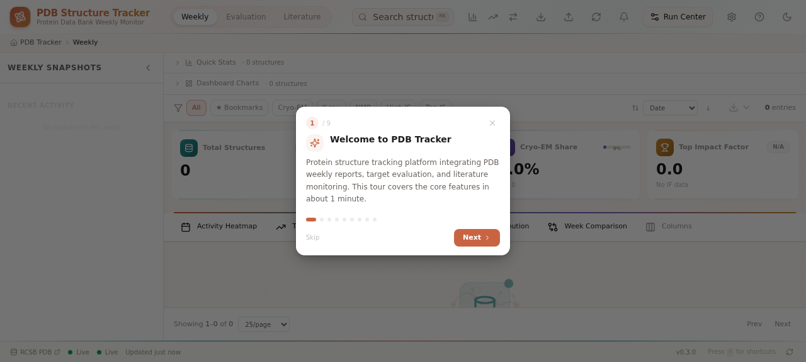
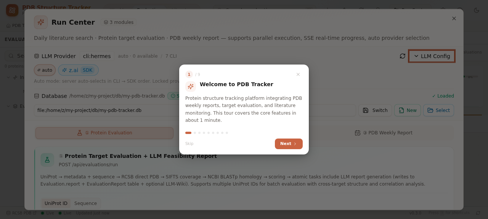
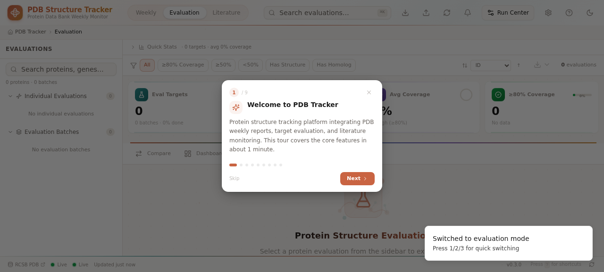
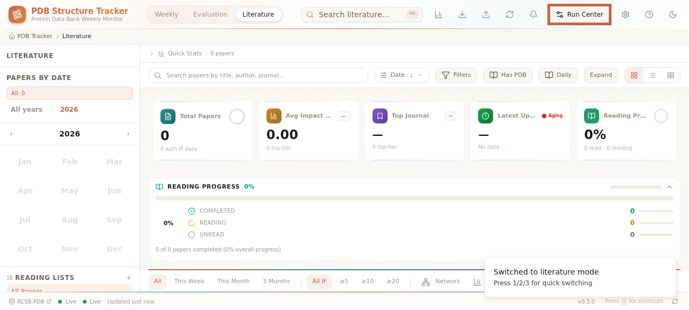
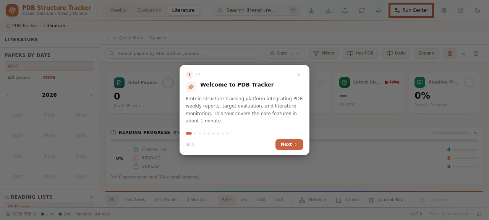

# PDB Structure Tracker

> 蛋白质数据银行结构追踪平台 — PDB 周报、靶点评估、文献监控一体化平台

A comprehensive platform for tracking Protein Data Bank (PDB) weekly releases, evaluating protein target druggability, and monitoring structural biology literature — all powered by LLM-driven analysis.



---

## Table of Contents / 目录

- [Overview / 概述](#overview--概述)
- [Key Features / 核心功能](#key-features--核心功能)
- [Technology Stack / 技术栈](#technology-stack--技术栈)
- [Architecture / 架构](#architecture--架构)
- [Quick Start / 快速开始](#quick-start--快速开始)
- [Modules / 模块详解](#modules--模块详解)
- [i18n / 国际化](#i18n--国际化)
- [Onboarding Tour / 引导教程](#onboarding-tour--引导教程)
- [Configuration / 配置](#configuration--配置)
- [API Reference / API 参考](#api-reference--api-参考)
- [Development / 开发](#development--开发)
- [Deployment / 部署](#deployment--部署)

---

## Overview / 概述

**English:**

PDB Structure Tracker is a full-stack web application that integrates three core workflows for structural biology researchers:

1. **Weekly PDB Monitoring** — Automatically fetches and categorizes new PDB structures released each week, with dashboard analytics, method distribution charts, and trend analysis.
2. **Protein Target Evaluation** — Evaluates protein druggability by combining UniProt metadata, RCSB PDB structures, SIFTS coverage mapping, NCBI BLASTp homology search, and LLM-generated feasibility reports.
3. **Literature Monitoring** — Dual-pathway PubMed search (keyword + journal RSS) with method filtering, LLM Chinese summary aggregation, and historical report playback.

**中文：**

PDB Structure Tracker 是一个全栈 Web 应用，为结构生物学研究人员整合了三大核心工作流：

1. **PDB 周报监控** — 自动获取并分类每周新发布的 PDB 结构，提供仪表盘分析、方法分布图表和趋势分析。
2. **蛋白靶点评估** — 通过整合 UniProt 元数据、RCSB PDB 结构、SIFTS 覆盖率映射、NCBI BLASTp 同源搜索和 LLM 生成的可行性报告，评估蛋白靶点的可成药性。
3. **文献监控** — PubMed 双通路检索（关键词 + 期刊 RSS），支持方法筛选、LLM 中文摘要聚合和历史报告回看。

---

## Key Features / 核心功能

| Feature | English | 中文 |
|---------|---------|------|
| **3 Modes** | Weekly / Evaluation / Literature | 周报 / 评估 / 文献 |
| **Batch Evaluation** | Multi-target batch eval with cross-target correlation | 多靶点批量评估 + 跨靶点相关性分析 |
| **Sequence Input** | AA / DNA sequence → auto-transcribe → BLASTp | 氨基酸/DNA 序列输入 → 自动转录 → BLASTp |
| **LLM Reports** | 8-chapter druggability report + PubMed literature | 8 章节可成药性报告 + PubMed 文献 |
| **Adversarial Weekly** | Generator → Critic → Synthesis (1-3 cycles) | 对抗式生成：Generator → Critic → Synthesis |
| **SSE Streaming** | Real-time progress for all modules | 所有模块支持 SSE 实时进度 |
| **3D Viewer** | Molstar-based structure visualization | 基于 Molstar 的 3D 结构可视化 |
| **i18n** | English / Chinese bilingual UI | 中英文双语界面 |
| **Onboarding Tour** | 9-step interactive tour with spotlight | 9 步交互式引导（聚光灯高亮） |
| **Dark Mode** | Full dark theme support | 完整深色主题支持 |

---

## Technology Stack / 技术栈

| Layer | Technology |
|-------|-----------|
| **Framework** | Next.js 16 (App Router, Webpack) |
| **Language** | TypeScript 5 |
| **Styling** | Tailwind CSS 4 + shadcn/ui (New York) |
| **Database** | Prisma ORM + SQLite |
| **3D Viewer** | Molstar |
| **Charts** | Recharts |
| **Animations** | Framer Motion |
| **Icons** | Lucide React |
| **LLM** | z.ai SDK (GLM-4.6) + CLI agents (Hermes/Claude/Codex) |
| **State** | React hooks + Zustand |
| **Server State** | TanStack Query patterns (custom SSE hooks) |

---

## Architecture / 架构

```
┌─────────────────────────────────────────────────────────────┐
│                    Caddy Gateway (:81)                       │
│                   Reverse Proxy + TLS                        │
├─────────────────────────────────────────────────────────────┤
│  Static Server (:3000)          │  API Server (:3001)       │
│  ┌─────────────────────┐        │  ┌──────────────────┐     │
│  │ Custom Node.js HTTP │        │  │ Next.js Standalone│     │
│  │ - Static HTML (mem) │───────▶│  │ - API Routes      │     │
│  │ - JS/CSS chunks     │        │  │ - Prisma Client   │     │
│  │ - API Proxy         │        │  │ - LLM Integration │     │
│  └─────────────────────┘        │  │ - BLAST Search    │     │
│                                 │  │ - SSE Streaming   │     │
│                                 │  └──────────────────┘     │
├─────────────────────────────────┴───────────────────────────┤
│                    SQLite Database                           │
│  PdbStructure │ Evaluation │ EvaluationBatch │ PubMedArticle │
│  WeeklyReport │ WeeklySnapshot │ LiteratureDigest │ ...      │
└─────────────────────────────────────────────────────────────┘
```

**Key design decisions:**
- **2-tier server**: Static file server (port 3000) proxies API requests to Next.js standalone (port 3001) to avoid SSR memory spikes
- **Cluster mode**: Both servers run in Node.js cluster mode (2 workers each) for concurrent request handling
- **Connection: close**: All responses use `Connection: close` to prevent Caddy keep-alive crashes

---

## Quick Start / 快速开始

### Prerequisites / 前提条件

- Node.js 18+ (or Bun)
- 4GB+ RAM (for LLM operations)

### Installation / 安装

```bash
# Clone the repository
git clone https://github.com/Jing0715-fer/pdb-tracker-web-v4.git
cd pdb-tracker-web-v4

# Install dependencies
bun install

# Build standalone production server
NODE_OPTIONS="--max-old-space-size=3072" bun run build

# Start the server
bash start-standalone.sh
```

### First Run / 首次运行

1. Open the app in your browser (default: `http://localhost:3000`)
2. The onboarding tour will auto-start (9 steps, ~1 minute)
3. After the tour, the Database Setup Wizard will appear
4. Click **"New"** to create a new SQLite database, or **"Select"** to use an existing one
5. All three modules now share this database



---

## Modules / 模块详解

### ① Protein Target Evaluation / 蛋白靶点评估



**Input modes:**
- **UniProt ID**: Single or multiple IDs (batch mode with cross-target analysis)
- **Sequence**: Amino acid or DNA sequence (DNA auto-transcribed to AA)

**Pipeline:**
```
UniProt ID → Metadata + Sequence
           → RCSB Direct PDB Match
           → SIFTS Coverage Mapping
           → NCBI BLASTp (pdbaa → nr fallback)
           → Scoring (structure/function/topology/feasibility)
           → LLM 8-Chapter Report (with PubMed literature)
```

**Batch evaluation features:**
- Multi-target simultaneous evaluation
- Common PDB structure detection across targets
- Cross-target correlation LLM report
- Batch matrix comparison view

### ② Literature Search / 文献检索



**Dual-pathway PubMed search:**
- **Path A**: MeSH terms + structural biology method keywords
- **Path B**: High-IF journal RSS + method keywords

**Features:**
- Method filtering (Cryo-EM / X-ray / NMR / AlphaFold)
- Per-paper LLM Chinese summary
- Optional executive summary aggregation
- Historical report playback by date

### ③ PDB Weekly Report / PDB 周报

**Adversarial generation pipeline:**
```
Fetch PDB entries → Backfill metadata
→ PubMed association
→ Generator (initial report)
→ Critic-Scientific (scientific review)
→ Synthesis (final report, optional)
→ Write to DB
```

- 1-3 cycle iteration for quality improvement
- Auto-detects latest available ISO week
- SSE streaming progress (estimated 5-15 min)

---

## i18n / 国际化

The app supports **English** and **Chinese** with a lightweight context-based i18n system.

**Switching languages:**
1. Click the **Settings** gear icon in the top toolbar
2. In the **Appearance** section, select **English** or **中文**
3. The UI updates instantly (no page reload)



**Implementation:**
- `src/lib/i18n/en.ts` — English translations
- `src/lib/i18n/zh.ts` — Chinese translations
- `src/lib/i18n/index.tsx` — `I18nProvider` + `useI18n()` hook
- Locale persisted in `localStorage`
- Scientific terms (Cryo-EM, X-ray, NMR, PDB ID, BLAST) kept in English

---

## Onboarding Tour / 引导教程

A 9-step interactive tour guides new users through the platform:

| Step | Title | Spotlight |
|------|-------|-----------|
| 1 | Welcome | Centered modal |
| 2 | Mode Switcher | Mode tabs |
| 3 | Database Setup | DB wizard dialog |
| 4 | Run Center | Run Center dialog |
| 5 | Evaluation Module | Tab content panel |
| 6 | Literature Module | Tab content panel |
| 7 | Weekly Module | Tab content panel |
| 8 | Search & Shortcuts | Search box |
| 9 | Ready to Go | Centered modal |

**Features:**
- Spotlight with dark mask overlay
- Tooltip card at bottom-right of spotlight
- Keyboard navigation (← → Esc)
- Progress dots indicator
- Auto-starts on first visit (desktop only)
- Replay via Help button (top-right)

---

## Configuration / 配置

### Database / 数据库

Database configuration is stored in `.hermes/db-config.json`:
```json
{
  "dbPath": "file:/home/z/my-project/db/pdb-tracker.db",
  "confirmed": true,
  "updatedAt": "2026-07-15T00:00:00.000Z"
}
```

### LLM Provider / LLM 提供方

The Run Center auto-detects available LLM providers:
- **CLI agents**: Hermes, Claude, Codex (via PATH or WSL)
- **z.ai SDK**: Built-in GLM-4.6 (no API key needed)
- **API**: Anthropic, OpenAI (requires API key)

Priority: CLI → SDK (auto mode), or lock to a specific provider.

### Evaluation Parameters / 评估参数

| Parameter | Default | Description |
|-----------|---------|-------------|
| `maxPdb` | 50 | Max PDB structures per target |
| `blastLimit` | 50 | Max BLAST hits |
| `maxLitCount` | 20 | Max PubMed literature in LLM context |
| `skipBlast` | false | Skip BLAST search |
| `forceBlast` | false | Force BLAST even if PDB match found |

---

## API Reference / API 参考

### Core Endpoints

| Method | Endpoint | Description |
|--------|----------|-------------|
| `GET` | `/api/snapshots` | List weekly snapshots |
| `GET` | `/api/entries?limit=N` | List PDB structures |
| `GET` | `/api/evaluations` | List evaluations + batches |
| `GET` | `/api/db-config` | Get DB status |
| `POST` | `/api/db-config` | Create/switch/confirm database |
| `POST` | `/api/evaluations/run` | Run evaluation (SSE stream) |
| `POST` | `/api/literature/daily/run` | Run literature search (SSE) |
| `POST` | `/api/pdb-weekly/run` | Generate weekly report (SSE) |
| `DELETE` | `/api/evaluations/:uniprotId` | Delete evaluation |
| `DELETE` | `/api/evaluations/batch/:batchId` | Delete batch |

### SSE Stream Events

All run endpoints return Server-Sent Events:
```typescript
interface StreamEvent {
  stage: string;      // 'fetch-metadata' | 'blast-search' | 'llm-report' | ...
  level: 'info' | 'success' | 'warn' | 'error';
  message: string;
  progress: number;   // 0-100
  data?: any;         // Result payload (on completion)
}
```

---

## Development / 开发

### Project Structure

```
src/
├── app/
│   ├── api/              # Next.js API routes
│   ├── layout.tsx        # Root layout (I18nProvider, ThemeProvider)
│   ├── page.tsx          # Main page (dynamic import PdbTracker)
│   └── globals.css       # Global styles + CJK font stack
├── components/
│   ├── pdb-tracker.tsx          # Main app component (~5000 lines)
│   ├── settings-run-panel.tsx   # Run Center dialog
│   ├── tour-overlay.tsx         # Onboarding tour
│   ├── db-setup-wizard.tsx      # Database setup wizard
│   ├── settings-panel.tsx       # Settings dialog
│   ├── evaluation-page.tsx      # Evaluation view
│   ├── WeeklyPdbTable.tsx       # PDB structure table
│   ├── EvalModeSwitcher.tsx     # Eval sidebar
│   ├── entity-panel.tsx         # 3D structure viewer panel
│   └── ...
├── hooks/
│   ├── use-tour.ts       # Tour logic
│   ├── use-app-settings.ts  # App preferences
│   └── use-run-stream.ts    # SSE stream hook
├── lib/
│   ├── i18n/             # Internationalization
│   │   ├── en.ts         # English translations
│   │   ├── zh.ts         # Chinese translations
│   │   └── index.tsx     # Provider + hook
│   ├── llm.ts            # LLM provider (z.ai SDK + CLI agents)
│   ├── blast.ts          # BLAST search (pdbaa + nr)
│   ├── db.ts             # Prisma client
│   └── pdb-types.ts      # TypeScript types
└── prisma/
    └── schema.prisma     # Database schema
```

### Running in Development

```bash
# Start dev server (hot reload)
bun run dev

# Run lint
bun run lint

# Push DB schema changes
bun run db:push
```

### Adding Translations

1. Add keys to `src/lib/i18n/en.ts` and `src/lib/i18n/zh.ts`
2. In your component, add `const { t, locale } = useI18n();`
3. Use `t.keyName` for direct references or `locale === 'zh' ? '中文' : 'English'` for inline

---

## Deployment / 部署

### Standalone Production Build

```bash
# Build
NODE_OPTIONS="--max-old-space-size=3072" bun run build

# Copy static assets
cp -r .next/static .next/standalone/.next/static
cp -r public .next/standalone/public

# Start (uses start-standalone.sh)
bash start-standalone.sh
```

### Server Architecture

The production deployment uses a 2-tier server architecture:

1. **Static Server (port 3000)**: Custom Node.js HTTP server
   - Serves static HTML from memory (no SSR overhead)
   - Serves JS/CSS chunks from pre-indexed file map
   - Proxies `/api/*` to port 3001 with `Connection: close`

2. **API Server (port 3001)**: Next.js standalone
   - Runs in cluster mode (2 workers, 384MB heap each)
   - Handles all API routes, Prisma, LLM, BLAST

3. **Caddy Gateway (port 81)**: Reverse proxy
   - Routes all traffic to port 3000

### Environment Variables

```env
DATABASE_URL=file:/path/to/database.db
NODE_ENV=production
```

---

## License / 许可证

MIT

---

## Acknowledgments / 致谢

- [RCSB PDB](https://www.rcsb.org/) — Protein Data Bank
- [PubMed/NCBI](https://pubmed.ncbi.nlm.nih.gov/) — Literature database
- [Molstar](https://molstar.org/) — 3D structure visualization
- [Next.js](https://nextjs.org/) — React framework
- [shadcn/ui](https://ui.shadcn.com/) — UI component library
- [z.ai](https://z.ai) — GLM-4.6 LLM model
